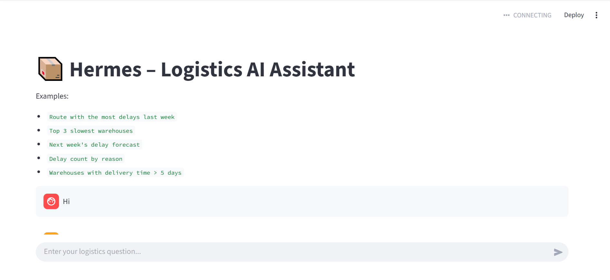

# Hermes -- Logistics AI Assistant

Hermes is a lightweight Logistics AI assistant built with Google ADK,
Gemini, Streamlit, and SQLite.

## Installation

1.  Install uv: pip install uv

2.  Clone repository: git clone
    https://github.com/AlexNhat/hermes_agent.git cd hermes_agent

3.  Create .env: GOOGLE_API_KEY="YOUR_GEMINI_API_KEY"

4.  Install dependencies: uv sync

5.  Run: uv run streamlit run app_streamlit.py

Open http://localhost:8501

## UI Screenshot

## Features

-   Natural language logistics Q&A
-   Route delay analysis
-   Top warehouse performance ranking
-   Weekly delay prediction (moving average)
-   All conversations saved to SQLite

## Database

SQLite file: hermes_logs.db

Table: chat_interactions( id INTEGER PRIMARY KEY AUTOINCREMENT, user_id
TEXT, user_message TEXT, assistant_message TEXT, user_timestamp TEXT,
assistant_timestamp TEXT, response_time_ms REAL, model_name TEXT )

## Workflow

User -\> Streamlit UI -\> Google ADK Agent -\> Tool analytics (pandas)
-\> Answer -\> SQLite log
